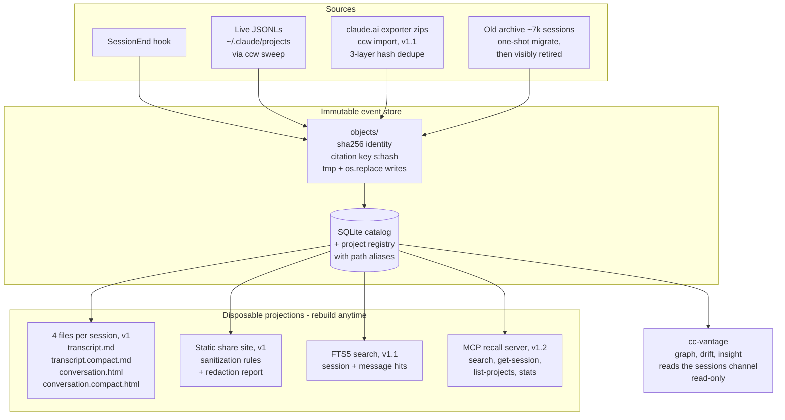

# cc-warehouse - store and projections

```mermaid
flowchart TD
    subgraph sources [Sources]
        direction TB
        HOOK[SessionEnd hook]
        LIVE[Live JSONLs<br/>~/.claude/projects<br/>via ccw sweep]
        WEB[claude.ai exporter zips<br/>ccw import, v1.1<br/>3-layer hash dedupe]
        OLD[Old archive ~7k sessions<br/>one-shot migrate,<br/>then visibly retired]
    end

    subgraph store [Immutable event store]
        direction TB
        CAS[objects/<br/>sha256 identity<br/>citation key s:hash<br/>tmp + os.replace writes]
        CAT[(SQLite catalog<br/>+ project registry<br/>with path aliases)]
    end

    subgraph projections [Disposable projections - rebuild anytime]
        direction TB
        FILES[4 files per session, v1<br/>transcript.md<br/>transcript.compact.md<br/>conversation.html<br/>conversation.compact.html]
        SITE[Static share site, v1<br/>sanitization rules<br/>+ redaction report]
        FTS[FTS5 search, v1.1<br/>session + message hits]
        MCP[MCP recall server, v1.2<br/>search, get-session,<br/>list-projects, stats]
    end

    VANTAGE[cc-vantage<br/>graph, drift, insight<br/>reads the sessions channel<br/>read-only]

    HOOK --> CAS
    LIVE --> CAS
    WEB --> CAS
    OLD --> CAS
    CAS --> CAT
    CAT --> FILES
    CAT --> SITE
    CAT --> FTS
    CAT --> MCP
    CAT --> VANTAGE
```
